# KODEX AI전력핵심설비 액티브 ETF 전략 (2026-1 개인 프로젝트)

## 핵심 결과물

[팩트시트 PDF 원본 보기](docs/AI전력핵심설비액티브factsheet.pdf) · [최종 발표자료 PPTX 다운로드](presentations/KODEX_AI_Power_Consensus_Active_Allocation_Strategy.pptx)

[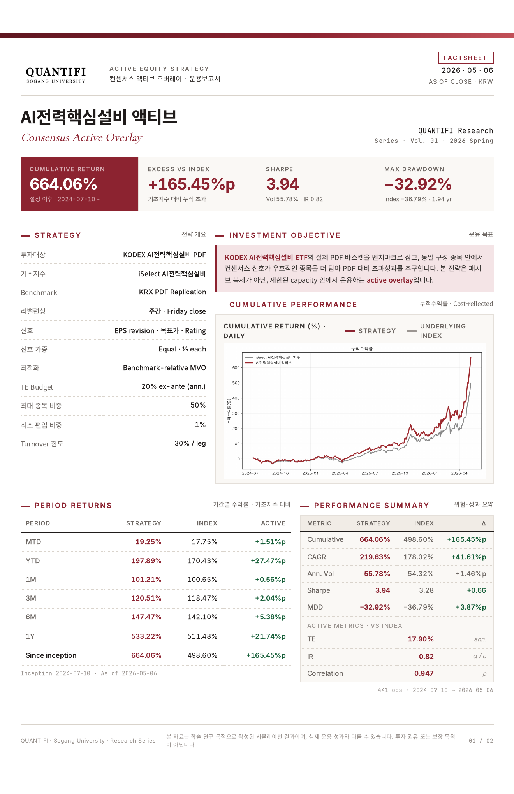](docs/AI전력핵심설비액티브factsheet.pdf)

[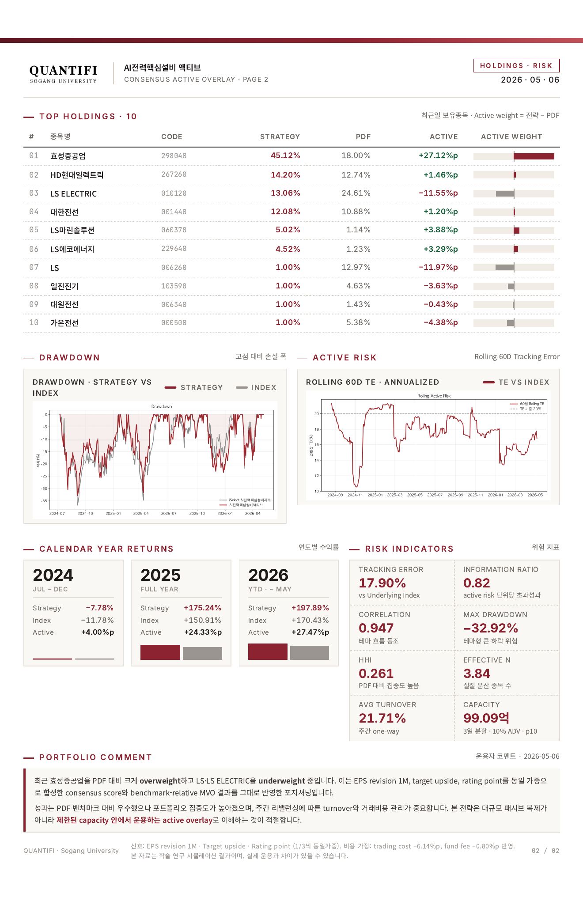](docs/AI전력핵심설비액티브factsheet.pdf)

## 프로젝트에서 수행한 일

- KRX 실제 PDF의 편입 종목과 비중을 수집하고, 당일 수익률에 전일 비중을 적용해 미래정보 편향을 차단한 복제 벤치마크를 구현했습니다.
- EPS revision 1M, 목표주가 괴리율, 투자의견을 표준화해 `ConsensusScore`를 만들고 주간 rank IC로 신호의 유효성을 검증했습니다.
- 단순 비중 틸트를 benchmark-relative MVO로 확장해 tracking error, 종목별 비중, turnover 제약 안에서 액티브 비중을 산출했습니다.
- 거래비용과 동적 슬리피지, 20일 ADV 기반 capacity, block bootstrap 및 Monte Carlo 경로 강건성까지 점검했습니다.
- 분석 결과를 운용 관점의 팩트시트와 최종 발표자료로 직접 구성했습니다.

`0503~0508`과 `0511~0515` 폴더의 AI전력핵심설비 ETF 프로젝트를 정리한 repo입니다.

핵심은 KODEX AI전력핵심설비 ETF를 그대로 예측하는 것이 아니라, 실제 KRX PDF 바스켓을 벤치마크로 복제한 뒤 같은 구성종목 안에서 컨센서스 신호가 좋은 종목을 더 담는 benchmark-relative active overlay 전략입니다.

최종 전략명은 다음입니다.

```text
consensus_active_mvo_te20_ra1_min1
```

## 한 줄 요약

KODEX AI전력핵심설비 ETF의 실제 PDF 구성종목을 투자 가능 유니버스로 제한하고, EPS revision, 목표주가 괴리율, 투자의견 점수를 동일가중한 `ConsensusScore`를 만든 뒤, PDF 대비 tracking error 20% 예산 안에서 active MVO로 비중을 재배분하는 전략입니다.

## 폴더 구성

| 경로 | 내용 |
| --- | --- |
| `notebooks/` | 전략 실험과 발표용 분석 노트북. `0503~0508`의 핵심 노트북 두 개를 포함했습니다. |
| `presentations/` | ETF 복제/개선 전략 PPT와 최종 컨센서스 액티브 배분 발표자료. |
| `src/` | PDF 복제, 패널 생성, 팩터 검증, active MVO, 비용/슬리피지, capacity, factsheet 산출 코드. |
| `input/` | 로컬 원본 데이터 배치 방법. 원본 파일 자체는 공개하지 않습니다. |
| `sample_data/` | 공개 가능한 합성 입력 스키마와 예시. |
| `output/charts/` | 발표와 README에 필요한 선별 차트. |
| `output/tables/` | 최종 성과, 비용, capacity, IC, holdings, robustness 표. |
| `docs/` | 완성된 팩트시트 PDF와 README 미리보기 이미지, factsheet 초안, 투자 제안, CIO 관점 권고, compliance note, feedback 문서. |

`0511~0515` 안에는 AI전력핵심설비 ETF 관련 PPT와 factsheet가 있었고, `.ipynb` 파일은 보이지 않아 노트북은 `0503~0508`의 KODEX AI전력핵심설비 노트북을 함께 정리했습니다.

## 왜 AI전력핵심설비 ETF인가

AI 전력핵심설비 ETF는 단순한 AI 테마가 아니라, 데이터센터 전력수요 증가가 전력망, 변압기, 전선, 전력기기 수요로 이어지는 실물 인프라 테마입니다.

```text
AI/데이터센터 투자 확대
-> 전력 사용량 증가
-> 전력망, 변압기, 전선, 전력기기 투자 확대
-> 구성기업의 수주, 매출, 영업이익, EPS 전망 변화
-> FnGuide 컨센서스와 애널리스트 의견에 반영
-> ETF 구성종목 안에서 상대적으로 더 좋은 종목을 더 담을 수 있는지 검증
```

따라서 이 프로젝트는 한국시장 전체에서 새 종목을 찾는 전략이 아니라, ETF가 이미 들고 있는 10여 개 전력설비 종목 내부에서 비중조정으로 초과성과를 만들 수 있는지 확인하는 연구입니다.

## 벤치마크 구조

전략은 세 가지 기준선을 구분합니다.

| 기준 | 의미 |
| --- | --- |
| KRX PDF 복제 포트폴리오 | 실제 ETF 구성종목/비중을 사용한 직접 벤치마크. 전략 비교의 중심입니다. |
| iSelect AI전력핵심설비 지수 | ETF가 추종하는 공식 기초지수. 유동시가총액 가중과 20% ceiling 구조가 적용됩니다. |
| ETF NAV/시장가격 | 실제 ETF 운용과 거래 결과를 확인하기 위한 참고 지표입니다. |

PDF 복제에서는 당일 수익률 계산에 전일 PDF 비중을 적용합니다. 이는 당일 PDF를 당일 수익률에 바로 쓰는 look-ahead 문제를 피하기 위한 처리입니다.

## 공개 데이터 정책

공개 전환 과정에서 가격·PDF·컨센서스·지수 원본은 저장소와 공개 Git 이력에서 제거했습니다. 공개 저장소에는 분석 코드, 합성 샘플 스키마와 생성 방법, 파생 결과표와 차트만 포함합니다.

```bash
python scripts/generate_sample_data.py
```

`sample_data/README.md`는 정규화 이후의 논리 스키마를 설명합니다. 합성 샘플은 공개된 성과 산출에 사용하지 않았으며, 실제 재실행에는 각 제공처에서 이용 권한을 확보한 데이터를 `input/`에 준비해야 합니다.

## 비공개 원본 입력 구조

최종 전략에 직접 들어가는 원본은 아래 다섯 묶음이며 공개 저장소에는 포함하지 않습니다.

| 입력 | 주요 파일 | 역할 |
| --- | --- | --- |
| ETF 실제 PDF 비중 | `input/kodex_ai_power_pdf_history.csv`, `input/kodex_ai_power_weights_pivot.csv` | PDF 벤치마크, active weight 기준 |
| 구성종목 가격/거래 데이터 | `input/2022_2026_price_data.xlsx` | 전략 수익률과 PDF 대비 성과 계산 |
| 공분산/ADV 보강 데이터 | `input/공분산추정,ADV용.xlsx` | 60일 공분산 추정과 20D ADV capacity 진단 |
| EPS 컨센서스 | `input/실적컨센선스24E.xlsx` ~ `input/실적컨센선스28E.xlsx` | EPS revision 1M 계산 |
| 목표주가/투자의견 | `input/목표주가,투자의견컨센선스.xlsx` | target upside, rating point 계산 |

평가 기간은 최종 factsheet 기준 `2024-07-10 ~ 2026-05-06`이며, 관측치는 441거래일입니다.

## 투자 가능 유니버스

투자 후보는 매 리밸런싱일의 KRX PDF에서 비중이 0보다 큰 종목으로 제한합니다.

```math
\mathcal{U}_t
= \left\{ i \mid w^{\mathrm{PDF}}_{i,t} > 0 \right\}
```

산일전기, 대원전선처럼 ETF에 나중에 편입된 종목은 PDF 편입 전에는 전략 비중을 부여하지 않습니다. 이렇게 처리하지 않으면 ETF가 아직 들고 있지 않은 종목을 미리 사는 look-ahead 성격의 오류가 생길 수 있습니다.

## ConsensusScore

최종 전략의 점수는 세 신호를 동일가중으로 결합합니다.

```math
\mathrm{ConsensusScore}_{i,t}
= \frac{1}{3} z\!\left(\mathrm{EPSRevision1M}_{i,t}\right)
+ \frac{1}{3} z\!\left(\mathrm{TargetUpside}_{i,t}\right)
+ \frac{1}{3} z\!\left(\mathrm{RatingPoint}_{i,t}\right)
```

각 신호의 의미는 다음과 같습니다.

| 신호 | 계산/의미 | 해석 |
| --- | --- | --- |
| EPS revision 1M | 다음 연도 EPS 컨센서스의 21거래일 변화율 | 최근 이익 전망이 상향되는 종목 선호 |
| Target upside | `(목표주가 - 현재가) / 현재가` | 애널리스트가 보는 상승 여력 |
| Rating point | 투자의견 포인트 | 애널리스트 의견 방향성 확인 |

세 신호는 단위가 다르므로 같은 날짜의 ETF 구성종목끼리 cross-sectional z-score로 표준화합니다. 결측값은 해당 날짜의 중앙값으로 채운 뒤 z-score를 계산해, 정보가 없는 종목이 극단적으로 좋거나 나쁘게 처리되지 않도록 했습니다.

## IC 검증

노트북에서는 리밸런싱일의 factor score 순위와 다음 리밸런싱 구간의 종목 수익률 순위를 Spearman rank IC로 비교했습니다.

PPT 기준 주간 IC 요약은 다음과 같습니다.

| 신호 | 관측 수 | 평균 IC |
| --- | ---: | ---: |
| Consensus score | 95 | 4.3% |
| EPS revision 1M | 91 | 4.8% |
| Target upside | 95 | 4.5% |
| Rating point | 43 | 5.0% |

세 신호의 정보 강도가 비슷하게 나와 최종 발표에서는 동일가중 score를 사용했습니다.

## 비중 산출 방식

초기 실험은 PDF 비중에 score multiplier를 곱해 점수가 높은 종목을 더 담는 방식이었습니다.

```math
\widetilde{w}_{i,t}
\propto
w^{\mathrm{PDF}}_{i,t}
\exp\left(\gamma \cdot \mathrm{ConsensusScore}_{i,t}\right)
```

최종 버전은 이 아이디어를 active MVO로 확장했습니다.

```math
\begin{aligned}
\max_{w_t}\quad
& s_t^\top \left(w_t - w^{\mathrm{PDF}}_t\right)
- \lambda \left(w_t - w^{\mathrm{PDF}}_t\right)^\top
\Sigma_t
\left(w_t - w^{\mathrm{PDF}}_t\right)
- \eta \left\|w_t - w_{t-1}\right\|_1 \\
\text{s.t.}\quad
& \sum_i w_{i,t} = 1 \\
& 0 \le w_{i,t} \le 50\% \\
& w_{i,t} \ge 1\% \quad \text{for included stocks} \\
& \mathrm{TE}_t \le 20\% \\
& \frac{1}{2}\sum_i |w_{i,t} - w_{i,t-1}| \le 30\%
\end{aligned}
```

직관은 단순합니다. 점수가 좋은 종목을 PDF보다 더 담되, 공분산으로 계산한 PDF 대비 active risk와 turnover가 과도해지지 않도록 조절합니다.

## 최종 운용 파라미터

| 항목 | 값 |
| --- | ---: |
| 리밸런싱 | 주간 |
| TE budget | 20% ex-ante annualized |
| 개별 최대비중 | 50% |
| 편입종목 최소비중 | 1% |
| One-way turnover limit | 30% |
| 공분산 lookback | 60거래일 |
| 공분산 shrinkage | diagonal 30% |
| Risk aversion | 1.0 |
| Turnover penalty | 0.05 |

## 비용 반영

성과는 비용 미반영 숫자가 아니라, 매매비용과 ETF 총보수ㆍ비용을 반영한 결과를 중심으로 봅니다.

| 비용 항목 | base 가정 |
| --- | ---: |
| 매매수수료 | 0.030% |
| 유관기관수수료 | 0.0036% |
| 슬리피지 | 0.030% |
| 매도세 | 2024년 0.18%, 2025년 0.15%, 2026년 이후 0.20% |
| 펀드 총보수ㆍ비용 | 연 0.4586% |

리밸런싱 비용은 직전 비중과 목표 비중 차이의 총 매매비중을 기준으로 계산합니다.

```math
\mathrm{Turnover}^{\mathrm{one-way}}_t
= \frac{1}{2}\sum_i
\left|w^{\mathrm{target}}_{i,t} - w^{\mathrm{prev}}_{i,t}\right|
```

```math
\mathrm{TotalTradedWeight}_t
= \sum_i
\left|w^{\mathrm{target}}_{i,t} - w^{\mathrm{prev}}_{i,t}\right|
```

## 최종 성과

`output/tables/factsheet_performance_summary.csv`와 `output/tables/final_metrics_summary_pretty.csv` 기준 핵심 결과입니다.

| 지표 | 최종 전략 | PDF benchmark |
| --- | ---: | ---: |
| 누적수익률 | 664.06% | 495.88% |
| PDF 대비 초과 누적수익률 | +168.18%p | - |
| 연환산수익률 | 219.63% | 177.30% |
| 연환산 변동성 | 55.78% | 54.10% |
| Sharpe ratio | 3.94 | 3.28 |
| 최대낙폭 | -32.92% | -36.67% |
| Tracking error | 17.90% | - |
| Information ratio | 0.843 | - |
| PDF와 상관계수 | 0.947 | 1.000 |
| 평균 one-way turnover, 전체 일자 | 4.71% | - |
| 평균 one-way turnover, 리밸런싱일 | 21.71% | - |

비용 미반영 누적수익률은 719.03%, 비용 반영 후 누적수익률은 664.06%입니다. 비용 drag는 약 -54.97%p입니다.

## 최신 보유비중 예시

`2026-05-06` 기준 top holdings입니다.

| 종목 | 전략 비중 | PDF 비중 | Active weight |
| --- | ---: | ---: | ---: |
| 효성중공업 | 45.12% | 18.00% | +27.12%p |
| HD현대일렉트릭 | 14.20% | 12.74% | +1.46%p |
| LS ELECTRIC | 13.06% | 24.61% | -11.55%p |
| 대한전선 | 12.08% | 10.88% | +1.20%p |
| LS마린솔루션 | 5.02% | 1.14% | +3.88%p |
| LS에코에너지 | 4.52% | 1.23% | +3.29%p |

전략은 최신 기준 효성중공업을 크게 overweight하고, LS와 LS ELECTRIC을 underweight합니다. 초과성과와 함께 집중도도 커지므로, HHI와 effective holdings를 별도로 관리해야 합니다.

## Capacity

20D ADV 기준 capacity는 운용규모가 커졌을 때 리밸런싱 주문을 시장에서 소화할 수 있는지 보기 위한 진단입니다.

| 체결 가정 | 시계열 하위 5% | 시계열 하위 10% | 중앙값 |
| --- | ---: | ---: | ---: |
| 1일 체결, 5% ADV | 12.33억 원 | 16.52억 원 | 64.85억 원 |
| 3일 분할, 5% ADV | 36.98억 원 | 49.55억 원 | 194.54억 원 |
| 1일 체결, 10% ADV | 24.66억 원 | 33.03억 원 | 129.70억 원 |
| 3일 분할, 10% ADV | 73.97억 원 | 99.09억 원 | 389.09억 원 |

발표 기준 capacity는 `3일 분할 x 10% ADV x 시계열 하위 10%`인 약 99.09억 원입니다. 보수 stress인 `1일 체결 x 5% ADV x 시계열 하위 5%`는 약 12.33억 원입니다.

## 동적 슬리피지 점검

고정 3bp 슬리피지가 지나치게 낙관적인지 확인하기 위해 20D ADV 참여율 연동 슬리피지도 별도로 점검했습니다.

```math
\mathrm{Participation}_{i,t}
=
\frac{\mathrm{AUM}\cdot |\Delta w_{i,t}| / D}
{\mathrm{ADV20}_{i,t}}
```

```math
\mathrm{DynamicSlippage}_{i,t}
= \mathrm{BaseSlippage}
+ k\sqrt{\mathrm{Participation}_{i,t}}
```

비교 결과는 다음과 같습니다.

| 비용 모델 | 누적수익률 | PDF 대비 초과 | Sharpe | TE | IR | 총 매매비용 |
| --- | ---: | ---: | ---: | ---: | ---: | ---: |
| 고정 3bp base | 664.06% | +168.18%p | 3.937 | 17.90% | 0.843 | -6.14%p |
| 20D ADV 참여율 연동 | 645.39% | +149.52%p | 3.856 | 17.91% | 0.763 | -8.62%p |

동적 비용에서도 초과성과가 유지되지만, 운용규모가 커지거나 1일 즉시 체결로 바꾸면 비용이 더 커질 수 있습니다.

## 강건성 검증

이 repo에는 다음 검증 산출물을 포함했습니다.

| 검증 | 파일 |
| --- | --- |
| Block bootstrap / Monte Carlo | `docs/resampling_monte_carlo_appendix.md`, `output/tables/resampling_monte_carlo_summary.csv` |
| PSR / DSR | `output/tables/probabilistic_sharpe_ratio_key_thresholds.csv`, `output/tables/deflated_sharpe_ratio_scenarios.csv` |
| 비용 민감도 | `output/tables/final_cost_model_comparison.csv` |
| Capacity | `output/tables/strategy_capacity_summary.csv` |
| Slippage | `output/tables/slippage_diagnostics_summary.csv` |
| 데이터 검증 | `output/tables/data_validation_summary.csv`, `docs/disclaimer_compliance_notes.md` |

해석상 중요한 점은, 이 결과를 완전한 out-of-sample alpha proof로 말하면 안 된다는 것입니다. ETF 상장 이후 표본이 짧고, 같은 테마 종목들이 높은 상관을 가지며, 컨센서스 데이터의 사용 가능 시점도 실제 운용에서는 추가 확인이 필요합니다.

## 주요 차트

이미지를 클릭하면 원본 크기의 차트를 확인할 수 있습니다.

<table>
  <tr>
    <td width="50%" valign="top">
      <strong>최종 전략과 PDF 벤치마크 누적성과</strong><br>
      <a href="output/charts/chart_final_cumulative_return.png">
        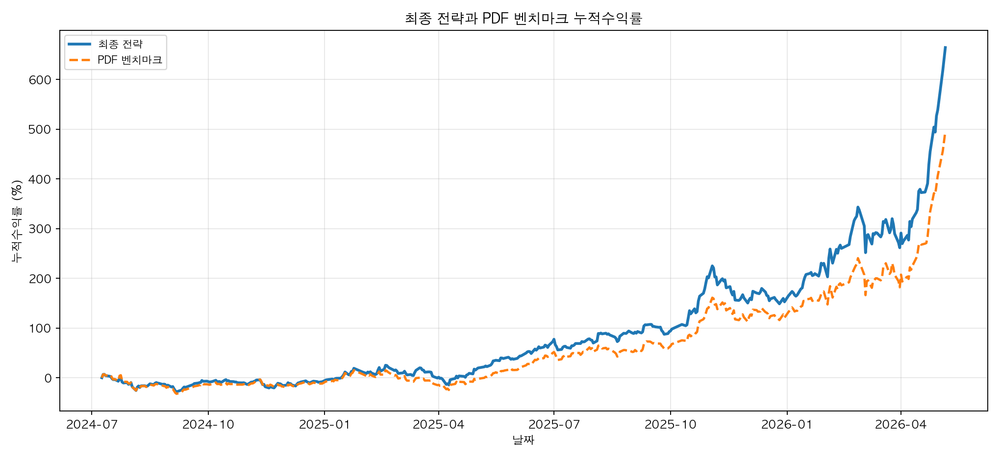
      </a>
    </td>
    <td width="50%" valign="top">
      <strong>PDF 대비 누적 액티브 수익률</strong><br>
      <a href="output/charts/chart_final_cumulative_active_return.png">
        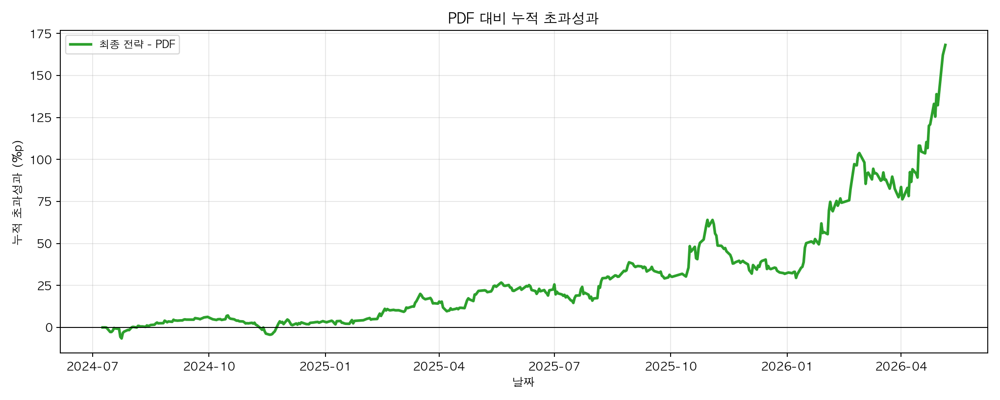
      </a>
    </td>
  </tr>
  <tr>
    <td width="50%" valign="top">
      <strong>리밸런싱별 액티브 비중 히트맵</strong><br>
      <a href="output/charts/chart_final_active_weight_heatmap.png">
        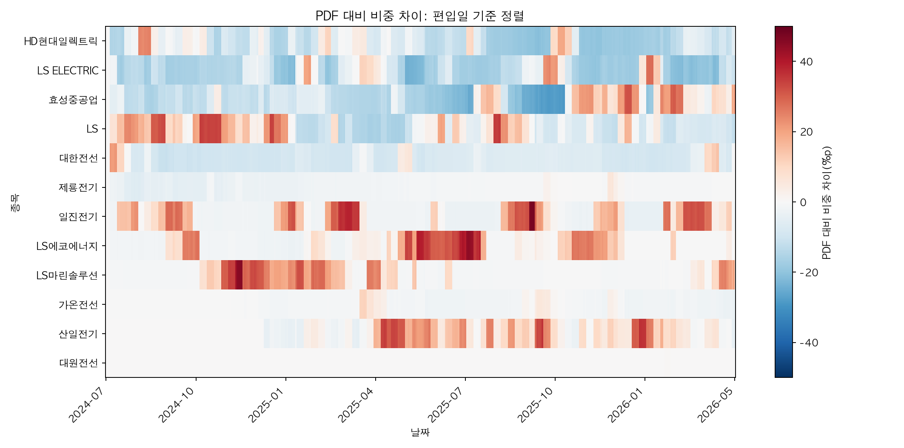
      </a>
    </td>
    <td width="50%" valign="top">
      <strong>주요 종목 액티브 비중 시계열</strong><br>
      <a href="output/charts/chart_final_top_active_weight_lines.png">
        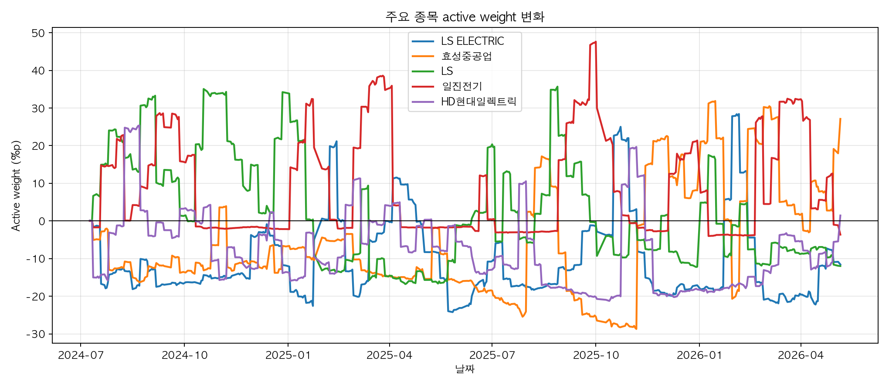
      </a>
    </td>
  </tr>
  <tr>
    <td width="50%" valign="top">
      <strong>전략과 기초지수 누적성과</strong><br>
      <a href="output/charts/chart_factsheet_cumulative_vs_index.png">
        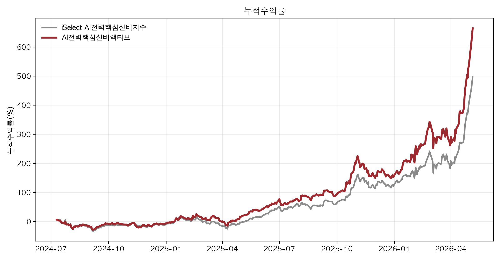
      </a>
    </td>
    <td width="50%" valign="top">
      <strong>전략과 기초지수 드로다운 비교</strong><br>
      <a href="output/charts/chart_factsheet_drawdown_vs_index.png">
        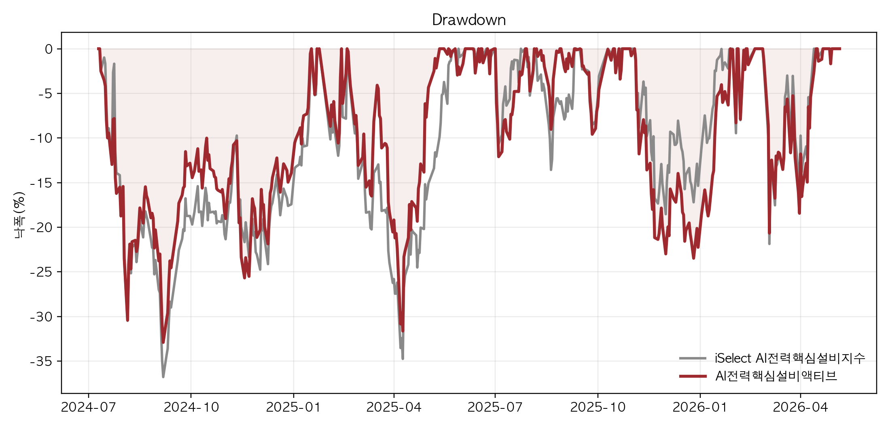
      </a>
    </td>
  </tr>
  <tr>
    <td colspan="2" align="center">
      <strong>롤링 트래킹에러</strong><br>
      <a href="output/charts/chart_factsheet_rolling_te_vs_index.png">
        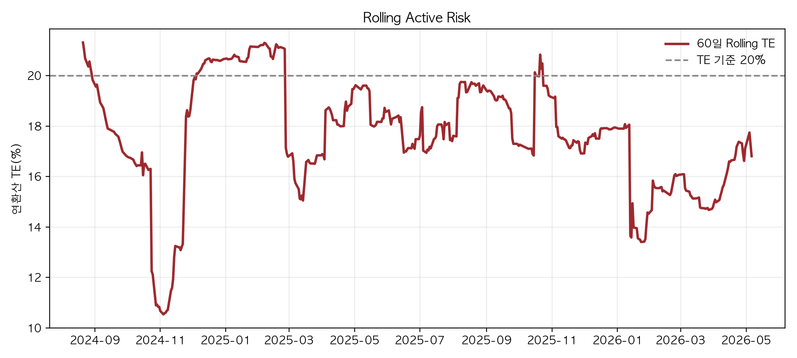
      </a>
    </td>
  </tr>
  <tr>
    <td width="50%" valign="top">
      <strong>최종 전략 드로다운</strong><br>
      <a href="output/charts/chart_final_drawdown.png">
        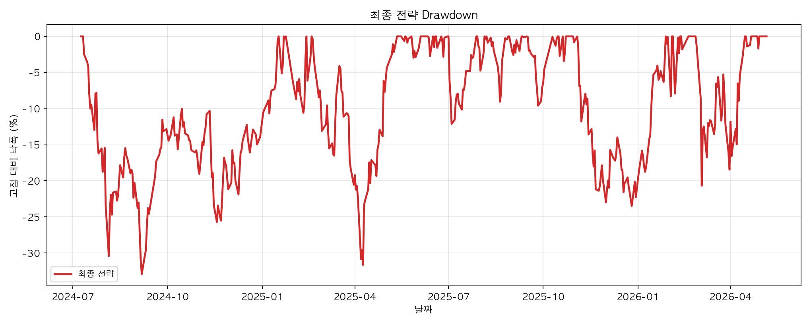
      </a>
    </td>
    <td width="50%" valign="top">
      <strong>편입 순서 기준 액티브 비중 히트맵</strong><br>
      <a href="output/charts/chart_final_active_weight_heatmap_ordered_by_inclusion.png">
        
      </a>
    </td>
  </tr>
  <tr>
    <td width="50%" valign="top">
      <strong>TE 오버레이 액티브 수익률</strong><br>
      <a href="output/charts/chart_active_te_overlay_active_return.png">
        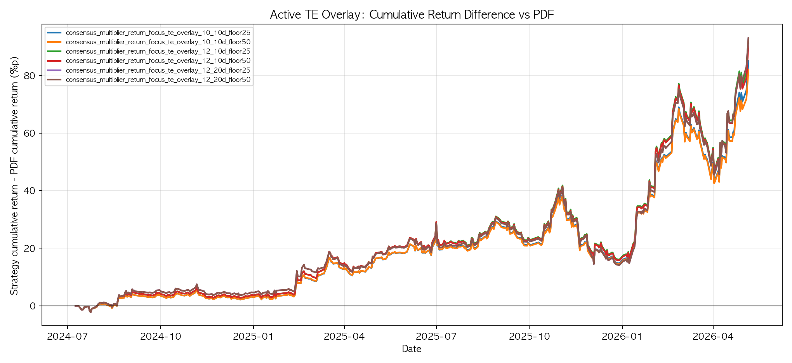
      </a>
    </td>
    <td width="50%" valign="top">
      <strong>TE 오버레이 수익률과 추적오차</strong><br>
      <a href="output/charts/chart_active_te_overlay_return_vs_te.png">
        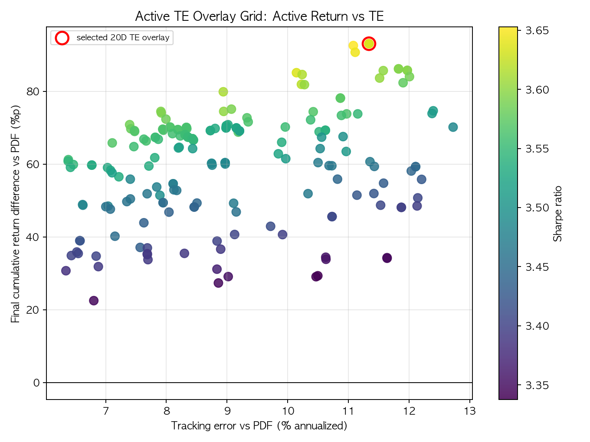
      </a>
    </td>
  </tr>
  <tr>
    <td width="50%" valign="top">
      <strong>강건성: 수익률과 추적오차</strong><br>
      <a href="output/charts/chart_final_robustness_return_vs_te.png">
        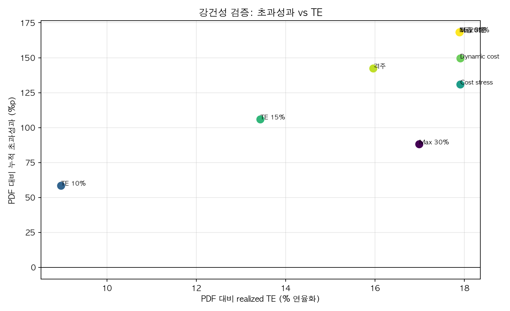
      </a>
    </td>
    <td width="50%" valign="top">
      <strong>재표본 초과수익률 분포</strong><br>
      <a href="output/charts/chart_resampling_mc_excess_return_distribution.png">
        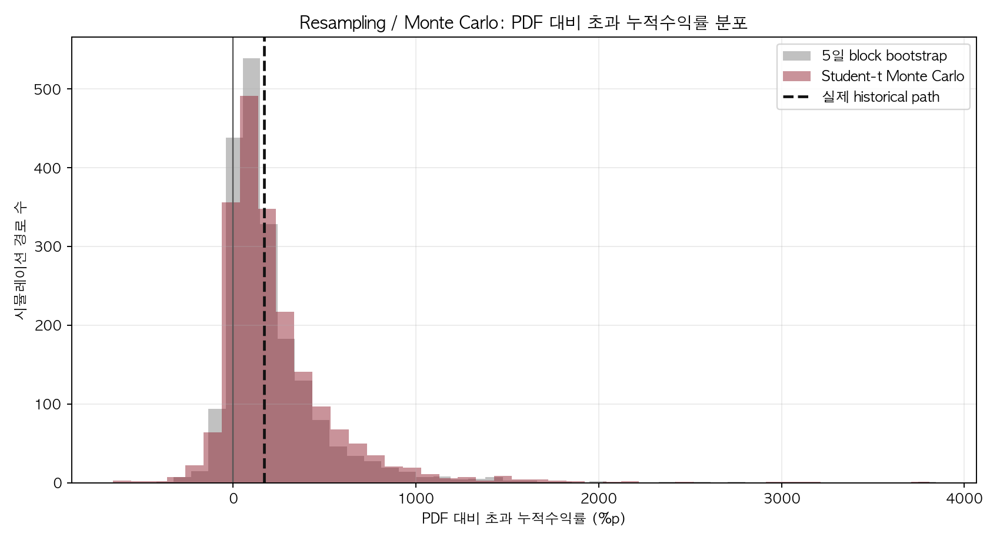
      </a>
    </td>
  </tr>
  <tr>
    <td colspan="2" align="center">
      <strong>확률적 샤프비율</strong><br>
      <a href="output/charts/chart_probabilistic_sharpe_ratio.png">
        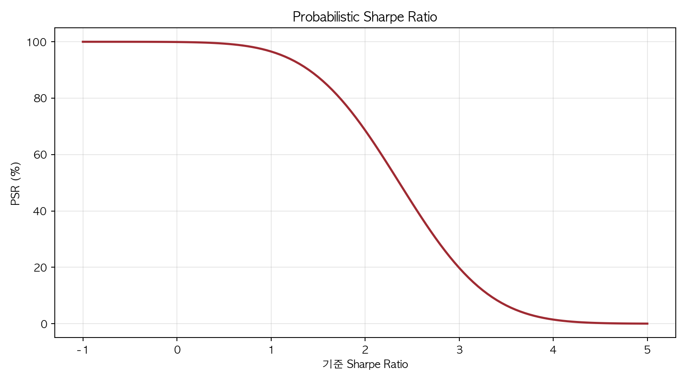
      </a>
    </td>
  </tr>
</table>

## 실행 순서

환경 설치:

```bash
pip install -r requirements.txt
```

코드 실행은 `src/` 기준으로 합니다.

```bash
cd src
python build_model_panel_v2.py
python benchmark_replication.py
python active_experiment_runner.py
python factsheet_diagnostics.py
python final_metrics_diagnostics.py
python resampling_monte_carlo_diagnostics.py
```

노트북에서 발표 흐름을 확인하려면:

```text
notebooks/KODEX_AI_power_active_experiment.ipynb
notebooks/KODEX_AI_power_ETF_replication_factor_tilt_presentation.ipynb
```

## 한계와 주의

- 연구 및 백테스트 목적의 정리본입니다.
- 과거 성과는 미래 성과를 보장하지 않습니다.
- 표본 기간이 짧아 실시간 paper/live pilot 검증이 필요합니다.
- 컨센서스 데이터의 실제 이용 가능 시점과 리밸런싱 시점 사이의 look-ahead 여부를 실제 운용 전 재검증해야 합니다.
- 원본 데이터는 공개하지 않으며, 합성 스키마와 파생 결과만 제공합니다.
